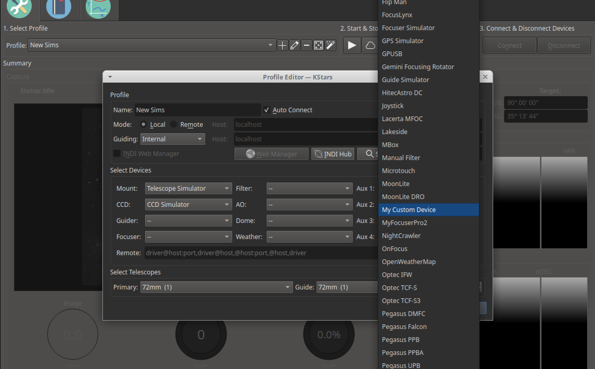

## A Simple Driver

This tutorial assumes you have setup your project structure to match [project-setup](project-setup.md).

Here is an example of a very simple driver. It doesn't do anything at all, but shows the bare minimum
that must be written to get a driver to run.

### indi_mycustomdriver.h

```cpp
#pragma once

#include "libindi/defaultdevice.h"

class MyCustomDriver : public INDI::DefaultDevice
{
public:
    MyCustomDriver();
    virtual ~MyCustomDriver() = default;

    // You must override this method in your class.
    virtual const char *getDefaultName() override;
};
```

### indi_mycustomdriver.cpp

```cpp
#include "config.h"
#include "indi_mycustomdriver.h"

// We declare an auto pointer to MyCustomDriver.
static std::unique_ptr<MyCustomDriver> mydriver(new MyCustomDriver());

MyCustomDriver::MyCustomDriver()
{
    setVersion(CDRIVER_VERSION_MAJOR, CDRIVER_VERSION_MINOR);
}

const char *MyCustomDriver::getDefaultName()
{
    return "My Custom Driver";
}
```

## Compiling

First create a `build` folder in your project's folder, move into it and configure the project with cmake.

```bash
mkdir build
cd build
cmake -DCMAKE_INSTALL_PREFIX=/usr -DCMAKE_BUILD_TYPE=Debug ../
```

If you look in the build folder, you should now see the `config.h` and `indi_mycustomdriver.xml` files
with the version info set properly.

Now we can build our executable.

```bash
make
```

And install it.

```bash
sudo make install
```

If you want to see your driver in KStars, be sure to restart it after installing your driver (only needed once).

So let's add it to a profile and start our driver.



When we do, we can see it in the INDI Control Panel, with the `Main Control`, `General Info`, and `Options` tabs available.


## Moving On

Now we have a driver running, but it doesn't do anything. So let's move on to [properties](properties.md).
