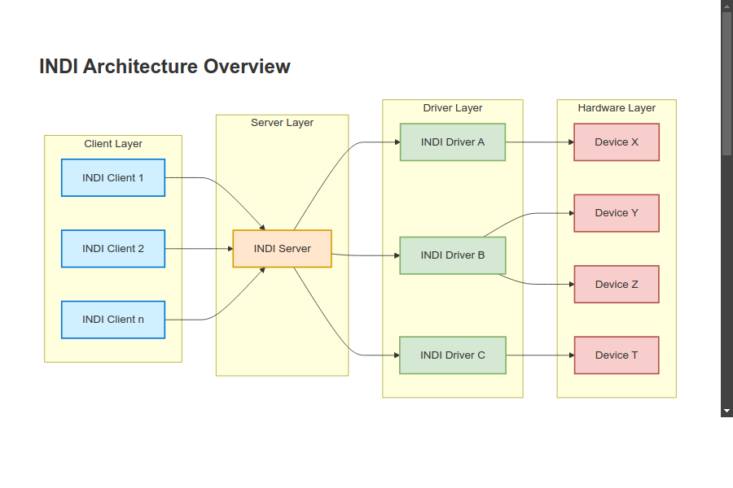

# INDI Technical Documentation

Welcome to the INDI Technical Documentation. This documentation provides comprehensive information about the INDI (Instrument-Neutral Distributed Interface) protocol and library, designed for controlling astronomical equipment.

## What is INDI?

INDI is an open-source protocol and framework designed for controlling astronomical equipment. It provides a standardized way for astronomical software to communicate with telescopes, cameras, focusers, filter wheels, and other astronomical devices.

Key features of INDI include:

- **Device Independence**: INDI allows software to control devices without needing to know the specific details of each device.
- **Network Transparency**: INDI uses a client-server architecture, allowing devices to be controlled over a network.
- **Cross-Platform**: INDI is available on Linux, macOS, and Windows (via WSL).
- **Extensible**: INDI can be extended to support new devices and functionality.
- **Open Source**: INDI is released under the GNU General Public License, allowing for community development and improvement.

## INDI Architecture

The INDI system consists of three main components:

1. **INDI Server**: A standalone process that manages the communication between INDI drivers and clients.
2. **INDI Drivers**: Processes that communicate with hardware devices and expose their functionality through INDI properties.
3. **INDI Clients**: Applications that connect to the INDI server, discover devices, and control device properties.

INDI server is the public network access point where one or more INDI Clients may contact one or more INDI Drivers. The indiserver launches each driver process and arranges for it to receive the INDI protocol from clients on its stdin and expects to find commands destined for clients on the driver's stdout. Anything arriving from a driver process' stderr is copied to indiserver's stderr. INDI server only provides convenient port, fork and data steering services. If desired, a client may run and connect to INDI Drivers directly.

## Documentation Structure

This documentation is organized into the following sections:

1. **[Introduction](/)**: Overview of the INDI protocol and library (this page)
2. **[Quick Guide](/quick-guide/)**: A concise introduction to key INDI concepts and how INDI drivers, servers, and clients work together
3. **[Protocol](/protocol/)**: Detailed information about the INDI protocol
4. **[Server](/indiserver/)**: Documentation on the INDI server
5. **[Drivers](/drivers/)**: Guide to developing INDI drivers
6. **[Clients](/clients/)**: Guide to developing INDI clients
7. **[Support](/support/)**: How to get support for INDI

## Getting Started

If you're new to INDI, we recommend starting with the [Quick Guide](/quick-guide/) to get a basic understanding of how INDI works. Then, depending on your interests, you can explore the more detailed documentation in the other sections.

For developers who want to create INDI drivers, the [Drivers](/drivers/) section provides comprehensive information on driver development, including tutorials, examples, and best practices.

For developers who want to create INDI clients, the [Clients](/clients/) section provides information on client development, including how to connect to INDI servers and control INDI devices.

## Resources

- [INDI Library Website](https://indilib.org/)
- [INDI GitHub Repository](https://github.com/indilib/indi)
- [INDI Forum](https://indilib.org/forum.html)
