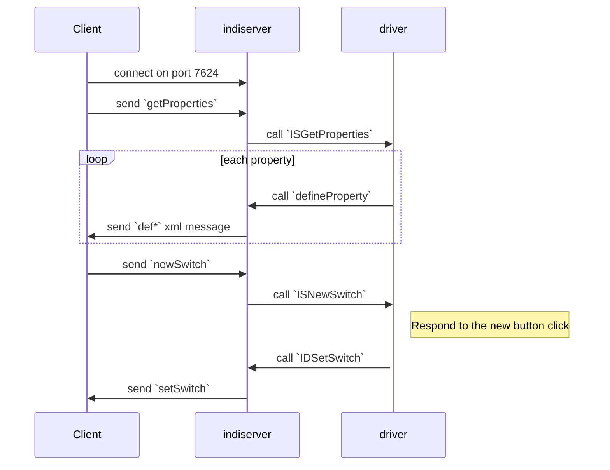

# INDI Protocol

## Overview

The reference documentation for the INDI protocol can be found [here](INDI.pdf).

INDI is a simple XML-like communications protocol described for interactive and
automated remote control of diverse instrumentation. INDI is small, easy to
parse, and stateless. In the INDI paradigm each Device poses all command and
status functions in terms of setting and getting Properties. Each Property is a
vector of one or more members. Each property has a current value vector; a
target value vector that provides information about how it should be sequenced
with respect to other Properties to accomplish one coordinates unit of
observation; and provides hints as to how it might be displayed for interactive
manipulation in a GUI.

The main key concept in INDI is that devices have the ability to describe
themselves. This is accomplished by using XML to describe a generic hierarchy
that can represent both canonical and non-canonical devices. All devices may
contain one or more properties. A property in the INDI paradigm describes a
specific function of the driver. Any property may contain one or more elements.

There are five types of INDI properties:

* Text property: Property to transfer simple text information in ISO-8859-1. The text is not encoded or encrypted on transfer. If the text includes elements that can break XML syntax, a BLOB property should be used to make the transfer.
* Number property: Property to transfer numeric information with configurable minimum, maximum, and step values. The supported number formats are decimal and sexigesmal. The property includes a GUI hint element in printf style format to enable clients to properly display numeric properties.
* Switch property: Property to hold a group of options or selections (Represented in GUI by buttons and check boxes).
* Light property: Property to hold a group of status indicators (Represented in GUI by colored LEDs).
* BLOB property: BLOB is a Binary Large OBject used to transfer binary data to and from drivers.

For example, all INDI devices share the CONNECTION standard switch property. The
CONNECTION property has two elements: CONNECT and DISCONNECT switches. GUI
clients parse the generic XML description of properties and builds a GUI
representation suitable for direct human interaction.

INDI does not pose any policies on how clients represent data, but some
properties include hints to clients as to how they should be represented.
Possible clients include simple loggers, GUI clients, and complex automated
scripts.

## Architecture

INDI is implemented as a client/server architecture. The INDI project provides a
reference implementation of an INDI server that can start one or more drivers,
connect to other running INDI servers, and accept connections from one or more
clients. Again, since INDI is just XML over TCP, you are free to implement your
own client or server in any language you wish.

This looks something like this:

```
INDI Client 1 --|                 |-- INDI Driver A -- Device X
                |                 |
INDI Client 2 --|                 |-- INDI Driver B -- Device Y
                |-- indiserver -- |               |
...             |                 |               | -- Device Z
                |                 |
INDI Client n --|                 |-- INDI Driver C -- Device T

Client       INET     Server      UNIX    Driver      Hardware
Processes   Sockets   Process     Pipes   Processes   Devices
```

## Typical INDI Communication


