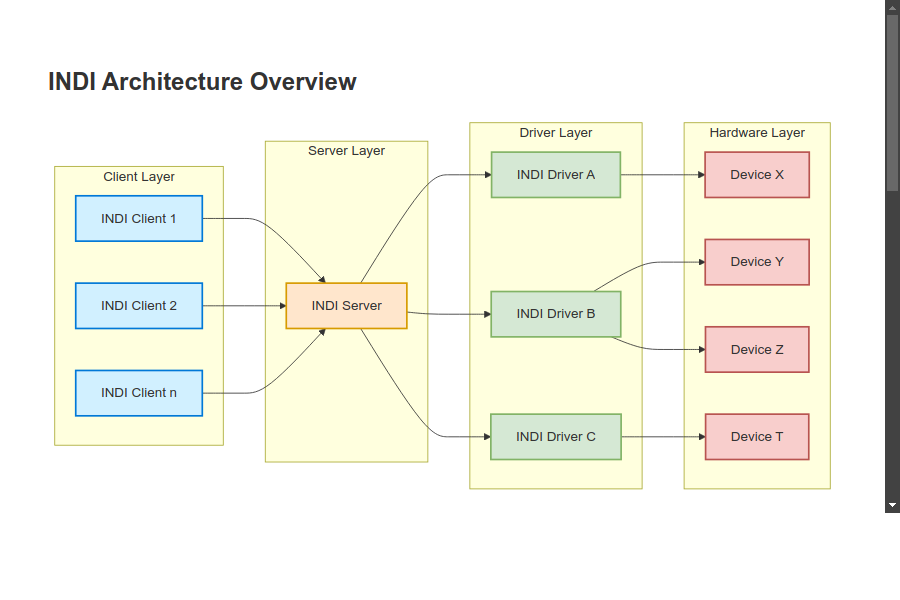
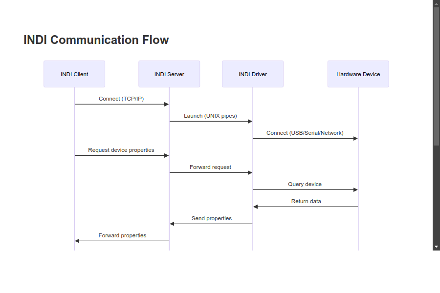

# INDI Quick Guide

This quick guide provides a concise introduction to key INDI concepts and how INDI drivers, servers, and clients work together. It's designed to give you a quick overview of the INDI ecosystem before diving into more detailed documentation.

## Key INDI Concepts

### INDI Protocol

The INDI protocol is an XML-based protocol for controlling astronomical devices. It defines a set of messages that clients and drivers can exchange to discover and control devices.

The protocol is based on the concept of **properties**, which represent device characteristics or functions. Properties can be of different types:

- **Text**: String values
- **Number**: Numeric values
- **Switch**: Boolean or enumerated values
- **Light**: Read-only status indicators
- **BLOB**: Binary data (e.g., images)

### INDI Architecture

INDI uses a client-server architecture:



1. **INDI Server**: Acts as a hub that connects clients to drivers
2. **INDI Drivers**: Communicate with hardware devices and expose their functionality through INDI properties
3. **INDI Clients**: Connect to the INDI server, discover devices, and control device properties

### Communication Flow

The communication flow in INDI follows this pattern:



1. Clients connect to the INDI server
2. Drivers register devices with the server
3. Clients discover available devices
4. Clients request device properties
5. Clients send commands to devices by updating property values
6. Drivers process commands and update property values
7. Clients receive property updates

## INDI Drivers

INDI drivers are processes that communicate with hardware devices and expose their functionality through INDI properties. Each driver can support one or more devices of the same type.

Drivers are responsible for:

- Establishing and managing connections to hardware devices
- Defining device properties
- Processing commands from clients
- Reporting device status and data to clients

INDI provides a C++ library (`libindi`) that makes it easy to develop drivers. The library includes base classes for different types of devices (telescopes, cameras, focusers, etc.) that implement common functionality.

## INDI Server

The INDI server (`indiserver`) is a standalone process that manages the communication between INDI drivers and clients. It provides:

- Network access to INDI drivers
- Device discovery
- Data routing between clients and drivers

The INDI server can run multiple drivers simultaneously, allowing clients to control multiple devices through a single connection.

To start the INDI server with one or more drivers:

```bash
indiserver indi_driver1 indi_driver2 ...
```

## INDI Clients

INDI clients are applications that connect to the INDI server, discover devices, and control device properties. Clients can be:

- **Graphical applications**: Like KStars/Ekos, INDI Control Panel, or PHD2
- **Command-line tools**: Like `indi_getprop` and `indi_setprop`
- **Scripts**: Using libraries like PyINDI or JavaScript INDI Client

Clients connect to the INDI server using TCP/IP, typically on port 7624. Once connected, they can:

- Discover available devices
- Get and set device properties
- Receive property updates
- Process binary data (e.g., images from cameras)

## Example: Controlling a Telescope

Here's a simple example of how INDI components work together to control a telescope:

1. Start the INDI server with a telescope driver:

   ```bash
   indiserver indi_celestron_gps
   ```

2. Connect a client (e.g., KStars/Ekos) to the INDI server

3. The client discovers the telescope device and its properties

4. The client connects to the telescope by setting the `CONNECTION` property

5. The client can now control the telescope by setting properties like:

   - `EQUATORIAL_EOD_COORD` to slew to coordinates
   - `TELESCOPE_MOTION_NS` and `TELESCOPE_MOTION_WE` for manual control
   - `TELESCOPE_PARK` to park/unpark the telescope

6. The driver processes these commands, communicates with the telescope hardware, and updates the property values

7. The client receives the updated property values and updates its UI accordingly

## Next Steps

This quick guide provides a basic overview of INDI. To learn more:

- [Protocol Documentation](/protocol/): Detailed information about the INDI protocol
- [Server Documentation](/indiserver/): More information about the INDI server
- [Driver Development](/drivers/): Guide to developing INDI drivers
- [Client Development](/clients/): Guide to developing INDI clients

For practical examples, check out the [INDI GitHub repository](https://github.com/indilib/indi) and the [INDI Library website](https://indilib.org/).
