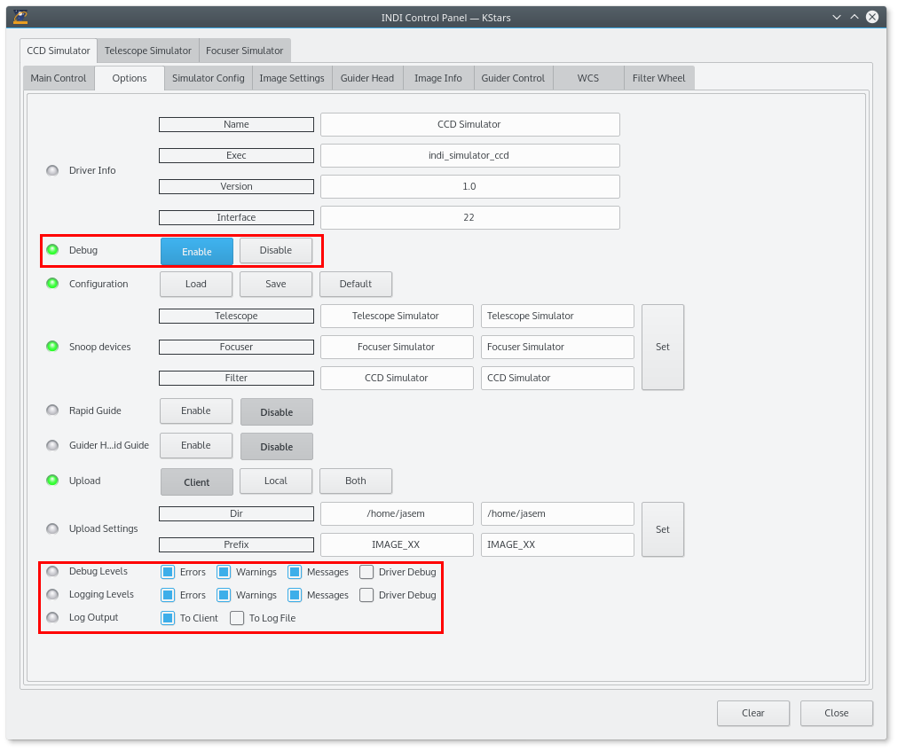

# INDI Support

This section provides information about how to get support for INDI driver development, troubleshooting common issues, and contributing to the INDI project.

## Getting Help

If you encounter issues while developing INDI drivers or clients, there are several resources available to help you:

### INDI Forum

The [INDI Forum](https://indilib.org/forum.html) is the primary place to ask questions, report issues, and discuss INDI development. The forum has several categories:

- **General Discussion**: General discussions about INDI
- **INDI Development**: Questions and discussions about INDI development
- **INDI Drivers**: Questions and discussions about specific INDI drivers
- **INDI Clients**: Questions and discussions about INDI clients
- **Bug Reports**: Report bugs in INDI drivers or clients

Before posting a question, please search the forum to see if your question has already been answered.

### GitHub Issues

If you find a bug in the INDI library or a specific driver, you can report it on GitHub:

- [INDI Library Issues](https://github.com/indilib/indi/issues): For issues with the INDI library or core drivers
- [INDI 3rd Party Issues](https://github.com/indilib/indi-3rdparty/issues): For issues with 3rd party drivers

When reporting a bug, please provide as much information as possible, including:

- A clear and concise description of the bug
- Steps to reproduce the bug
- Expected behavior
- Actual behavior
- Logs or error messages
- System information (OS, INDI version, etc.)

### Mailing List

The [INDI Development Mailing List](https://sourceforge.net/projects/indi/lists/indi-devel) is used for discussions about INDI development. You can subscribe to the mailing list to stay informed about INDI development and ask questions.

### IRC Channel

The INDI IRC channel (#indilib on irc.libera.chat) is a place to chat with INDI developers and users in real-time. You can join the channel using an IRC client or the [web interface](https://web.libera.chat/#indilib).

## Troubleshooting

If you encounter issues while developing or using INDI drivers, the [Troubleshooting](troubleshooting.md) guide provides solutions to common problems, including:

- Connection problems
- Communication issues
- Property issues
- Performance issues
- Driver initialization issues
- Thread-related issues
- Device-specific issues

## Debugging

INDI provides several tools and techniques for debugging drivers and clients:

### INDI Debug Logs

INDI drivers and clients can generate debug logs that provide detailed information about their operation. To enable debug logs:

1. Start the INDI server with the `-v` option:

   ```bash
   indiserver -v indi_driver1 indi_driver2 ...
   ```

2. Set the debug level in your INDI client (if supported)

3. Check the logs for error messages and warnings



### INDI Control Panel

The INDI Control Panel is a graphical tool for testing and debugging INDI drivers. It allows you to:

- Connect to INDI servers
- View and modify device properties
- Monitor property updates
- View debug messages

To use the INDI Control Panel:

1. Start the INDI server with your driver:

   ```bash
   indiserver indi_mydriver
   ```

2. Launch the INDI Control Panel:

   ```bash
   indi_control_panel
   ```

3. Connect to the INDI server and select your device

### GDB Debugging

For more advanced debugging, you can use the GNU Debugger (GDB) to debug INDI drivers:

1. Compile your driver with debug symbols:

   ```bash
   cmake -DCMAKE_BUILD_TYPE=Debug ..
   make
   ```

2. Start the INDI server with GDB:

   ```bash
   gdb --args indiserver indi_mydriver
   ```

3. Set breakpoints and debug your driver:
   ```
   (gdb) break MyDriver::ISNewNumber
   (gdb) run
   ```

## Contributing to INDI

INDI is an open-source project, and contributions are welcome! Here are some ways you can contribute:

### Reporting Bugs

If you find a bug in INDI, please report it on GitHub:

- [INDI Library Issues](https://github.com/indilib/indi/issues)
- [INDI 3rd Party Issues](https://github.com/indilib/indi-3rdparty/issues)

### Submitting Patches

If you have a fix for a bug or a new feature, you can submit a pull request:

1. Fork the INDI repository
2. Create a branch for your changes
3. Make your changes
4. Submit a pull request

For more information, see the [GitHub Flow](https://guides.github.com/introduction/flow/) guide.

### Developing Drivers

If you have a device that is not supported by INDI, you can develop a driver for it. For more information, see the [Driver Development](../drivers/) documentation.

### Improving Documentation

If you find errors or omissions in the INDI documentation, you can submit corrections or additions to the [INDI Documentation Repository](https://github.com/indilib/docs).

### Translating INDI

If you speak a language other than English, you can help translate INDI to your language. For more information, see the [INDI Translation Guide](https://www.indilib.org/develop/developer-manual/163-indi-translation-guide.html).

## Community

INDI has a vibrant community of developers and users. You can connect with the community through:

- [INDI Forum](https://indilib.org/forum.html)
- [INDI Development Mailing List](https://sourceforge.net/projects/indi/lists/indi-devel)
- [INDI IRC Channel](https://web.libera.chat/#indilib)
- [INDI GitHub Organization](https://github.com/indilib)

## Resources

Here are some additional resources for INDI development:

- [INDI Library Website](https://indilib.org/)
- [INDI GitHub Repository](https://github.com/indilib/indi)
- [INDI 3rd Party Repository](https://github.com/indilib/indi-3rdparty)
- [INDI API Documentation](https://www.indilib.org/api/index.html)
- [INDI Protocol Specification](https://www.indilib.org/develop/developer-manual/104-indi-protocol.html)
